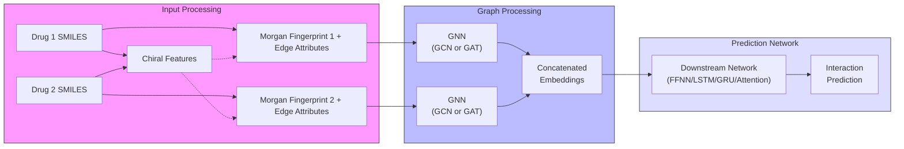

# Mol-DDI: Exploring Molecular Graphs for Drug-Drug Interaction Prediction

Authors: Ne Dassanayake, Yiqing Du, Izzy Zhu

This repository contains the code for Mol-DDI (Exploring Molecular Graphs for Drug-Drug Interaction Prediction), a final project for MIT's 6.7960 Deep Learning class. For detailed information about the methodology and results, please refer to index.html in the submission folder.

A dataset consisting of SMILES encodings of drug pairs are passed into GNNs to generate embeddings. These embeddings are concatenated and fed into a downstream feedforward or memory network to output a predicted probability of interaction. A diagram of our pipeline is shown below.

## Files

The folder models contains three files: GAT.py and GCN.py are the code for the graph neural networks used to generate embeddings for the molecules. DDI_prediction.py contains the downstream networks.

The folder processed_data contains three tsv files, all compressed with the gz method. processed_drug_pairs contains the reported drug-drug interactions from the Ch-Ch Miner dataset, combined_drug_pairs contains a 1:1 split of randomly generated negative to positive examples, and combined_drug_pairs_similarity_score contains a 1:1 split of negative pairs (sorted from highest to lowest Tanimoto similarity) to positive examples. The folder processing contains the scrips used to generate the processed datasets.

MoltoGraph contains files that convert a SMILES string into a graph (with Morgan Fingerprints generated with or without chirality) that can be directly passed into the GNNs. 

The submission folder contains an HTML file containing a blog post discussing the project.

## How to Use

Ensure all dependencies are installed:

 - torch
 - torch_geometric
 - rdkit
 - numpy
 - pandas
 - scikit-learn
 - matplotlib
 - json
 - os
 - tqdm
 - tempfile
 - shutil
 - gzip
 - typing
 - csv
 - PIL

Modify the code in the entry point of train.py, initializing the desired model, then run the script. The evaluation loop and data processing will be called by the script. To visualize the embedding space, set the save_model flag to True during training, choose a directory to save to, then run embed_visualization.py and edit the entry point with the saved model, desired number of clusters, and desired number of randomly sampled molecules.

To train with contrastive loss, use the train-contrastive script instead. The threshold for Tanimoto similarity is set to 0.1 (the 99% quantile in this dataset)

gat_lstm was the best performing model, gat_lstm_sim_pen is the gat_lstm trained with contrastive loss
