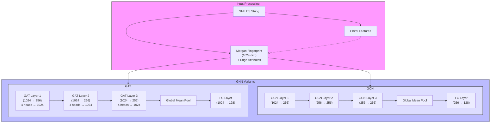
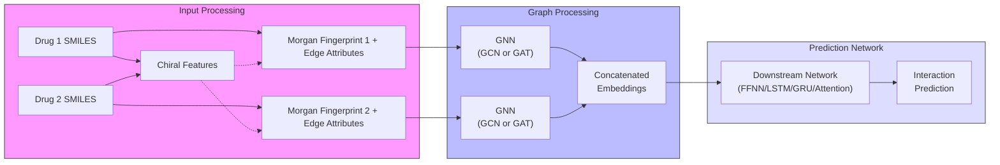

```mermaid
flowchart TD
    subgraph Input["Input Processing"]
        SMILES["SMILES String"] --> MF["Morgan Fingerprint<br>(1024 dim)<br> + Edge Attributes"]
        SMILES --> CHIRAL["Chiral Features"]
    end

    subgraph GNN["GNN Variants"]
        subgraph GCN["GCN"]
            GC1["GCN Layer 1<br>(1024 → 256)"] --> 
            GC2["GCN Layer 2<br>(256 → 256)"] -->
            GC3["GCN Layer 3<br>(256 → 256)"]
            GC3 --> GPOOL["Global Mean Pool"] -->
            FC2["FC Layer<br>(256 → 128)"]
         end
        
        subgraph GAT["GAT"]
            GA1["GAT Layer 1<br>(1024 → 256)<br>4 heads → 1024"] --> GA2["GAT Layer 2<br>(1024 → 256)<br>4 heads → 1024"] --> GA3["GAT Layer 3<br>(1024 → 256)<br>4 heads → 1024"]
            GA3 --> GAPOOL["Global Mean Pool"] --> FC1["FC Layer<br>(1024 → 128)"]
        end
    end

    MF --> GCN
    MF --> GAT
    CHIRAL -.-> MF

    
    style Input fill:#f9f,stroke:#333
    style GNN fill:#bbf,stroke:#333
    style GCN fill:#ddf,stroke:#333
    style GAT fill:#ddf,stroke:#333
```

```mermaid
flowchart TD
    GNN1["GNN Output 1<br>(128 dim)"] & GNN2["GNN Output 2<br>(128 dim)"] --> EMB["Embeddings"]
    
    subgraph Downstream["Downstream Networks"]
        subgraph FFNN["Standard FFNN"]
            FCAT["Concatenate<br>(256 dim)"] --> 
            F1["Dense + GeLU<br>(256→256)"] --> 
            F2["Dense + GeLU<br>(256→256)"] -->
            F3["Dense + GeLU<br>(256→256)"] -->
            F4["Dense + Sigmoid<br>(256→1)"]
        end
        
        subgraph LSTM["LSTM Network"]
            LSTACK["Stack Embeddings<br>(2×128 = 256)"] -->
            L1["LSTM Layer<br>(256→256)"] --> 
            L2["Dense + GeLU<br>(256→256)"] -->
            L3["Dense + Sigmoid<br>(256→1)"]
        end
        
        subgraph GRU["GRU Network"]
            GSTACK["Stack Embeddings<br>(2×128 = 256)"] -->
            G1["GRU Layer<br>(256→256)"] -->
            G2["Dense + GeLU<br>(256→256)"] -->
            G3["Dense + Sigmoid<br>(256→1)"]
        end
        
        subgraph ATTF["FFNN with Attention"]
            A1["Cross Attention<br>Q,K,V: 128→256"] -->
            A2["Dense + GeLU<br>(256→256)"] -->
            A3["Dense + GeLU<br>(256→256)"] -->
            A4["Dense + GeLU<br>(256→256)"] -->
            A5["Dense + Sigmoid<br>(256→1)"]
        end
    end
    
    EMB --> FFNN
    EMB --> LSTM
    EMB --> GRU
    EMB --> ATTF
    
    FFNN --> OUT["Binary Output<br>Interaction Probability"]
    LSTM --> OUT
    GRU --> OUT
    ATTF --> OUT
    
    style Downstream fill:#bbf,stroke:#333
    style FFNN fill:#ddf,stroke:#333
    style LSTM fill:#ddf,stroke:#333
    style GRU fill:#ddf,stroke:#333
    style ATTF fill:#ddf,stroke:#333
    style OUT fill:#f9f,stroke:#333
```

```mermaid
flowchart LR
    subgraph Input["Input Processing"]
        D1["Drug 1 SMILES"] --> FP1["Morgan Fingerprint 1 + Edge Attributes"]
        D2["Drug 2 SMILES"] --> FP2["Morgan Fingerprint 2 + Edge Attributes"]

        D1 --> CHIRAL["Chiral Features"] -.-> FP2
        D2 --> CHIRAL["Chiral Features"] -.-> FP1
    end
    
    subgraph Processing["Graph Processing"]
        FP1 --> GNN1["GNN<br>(GCN or GAT)"]
        FP2 --> GNN2["GNN<br>(GCN or GAT)"]
        GNN1 --> CONCAT["Concatenated<br>Embeddings"]
        GNN2 --> CONCAT
    end
    
    subgraph Prediction["Prediction Network"]
        CONCAT --> DN["Downstream Network<br>(FFNN/LSTM/GRU/Attention)"]
        DN --> OUT["Interaction<br>Prediction"]
    end


    
    style Input fill:#f9f,stroke:#333
    style Processing fill:#bbf,stroke:#333
    style Prediction fill:#ddf,stroke:#333

```